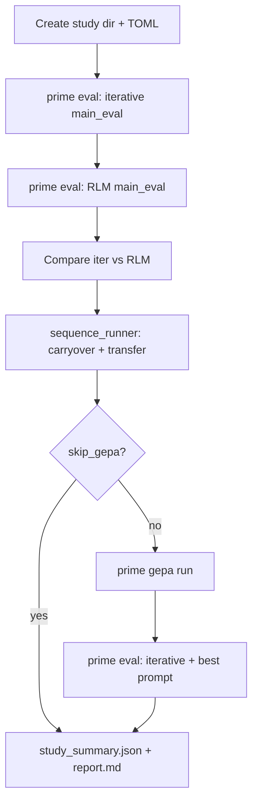

# AdvancedIF Skill 

It compares:

- `advancedif_iter_skill`: iterative tool-using baseline
- `advancedif_rlm_skill`: `verifiers` `RLMEnv` baseline
- `prime gepa run advancedif_iter_skill`: prompt-only optimization baseline

The task is to produce the next assistant answer for an AdvancedIF conversation while optionally updating a carried `skill.md`. A hidden judge has the full rubric and only exposes one of three limited feedback modes:

- `score_only`
- `one_violation`
- `none`

## Layout

- `core/`: dataset loading, judge logic, prompts, config, and env implementations
- `advancedif_iter_skill.py`: iterative env entrypoint with direct `load_environment`
- `advancedif_rlm_skill.py`: RLM env entrypoint with direct `load_environment`
- `sequence_runner.py`: carryover + frozen-transfer rollout logic and CLI
- `run_initial_study.py`: prints or writes the recommended narrow first-pass study
- `run_study.py`: runs the study end-to-end and writes `report.md` plus `study_summary.json`
- `run_research_suite.py`: prints or writes the full study command list (same as [Research suite commands](#research-suite-commands) below)
- `configs/eval/`: `prime eval run` configs
- `configs/gepa/`: `prime gepa run` configs
- `configs/rl/prime_rl_stub.toml`: dormant phase-two training stub

## Setup

From this directory:

```bash
uv sync
export PRIME_API_KEY=...
```

## Quick smoke

Iterative eval:

```bash
uv run prime eval run configs/eval/iter_score_only_smoke.toml
```

RLM eval:

```bash
uv run prime eval run configs/eval/rlm_score_only_smoke.toml
```

Carryover runner:

```bash
uv run python sequence_runner.py \
  --env advancedif_iter_skill \
  --model openai/gpt-4.1-mini \
  --judge-model z-ai/glm-4.7
```

Recommended initial study:

```bash
uv run python run_initial_study.py
```

Run the actual study and produce the analysis markdown:

```bash
uv run python run_study.py
```

## Recommended First Study

Start narrower than the full suite.

Use one matched comparison first:

- same policy model in both harnesses
- `score_only` feedback
- `main_eval` split
- same judge model

Recommended order:

1. Run `advancedif_iter_skill` vs `advancedif_rlm_skill` on `score_only`.
2. Compare `criterion_satisfaction_mean`, `first_submission_lift_mean`, and `reward_per_1k_tokens_mean`.
3. Run carryover + frozen-transfer only on the more promising harness.
4. Run GEPA afterward if the iterative baseline remains competitive enough to be a meaningful prompt-only comparator.

You can print or write that exact command list with:

```bash
uv run python run_initial_study.py
uv run python run_initial_study.py -o /path/to/initial_study.md
```

To actually execute the study and write the final analysis report:

```bash
uv run python run_study.py
```

That command creates a timestamped directory under `outputs/studies/` containing:

- generated study-local configs
- command logs
- saved eval and sequence artifacts
- `study_summary.json`
- `report.md`

### `run_study.py` execution flow

End-to-end orchestration (configs → Prime eval → sequence runner → optional GEPA → report):



## Research suite commands

### Independent evaluations

- `uv run prime eval run configs/eval/iter_score_only_main_eval.toml`
- `uv run prime eval run configs/eval/iter_one_violation_main_eval.toml`
- `uv run prime eval run configs/eval/iter_none_main_eval.toml`
- `uv run prime eval run configs/eval/rlm_score_only_main_eval.toml`
- `uv run prime eval run configs/eval/rlm_one_violation_main_eval.toml`
- `uv run prime eval run configs/eval/rlm_none_main_eval.toml`

### GEPA

- `uv run prime gepa run configs/gepa/iter_score_only_gepa.toml`

### Carryover and transfer

- `uv run python sequence_runner.py --env advancedif_iter_skill --model openai/gpt-4.1-mini --feedback-mode score_only --judge-model z-ai/glm-4.7`
- `uv run python sequence_runner.py --env advancedif_iter_skill --model openai/gpt-4.1-mini --feedback-mode one_violation --judge-model z-ai/glm-4.7`
- `uv run python sequence_runner.py --env advancedif_rlm_skill --model openai/gpt-4.1-mini --feedback-mode score_only --judge-model z-ai/glm-4.7`
- `uv run python sequence_runner.py --env advancedif_rlm_skill --model openai/gpt-4.1-mini --feedback-mode one_violation --judge-model z-ai/glm-4.7`

To regenerate the same markdown (for example after editing `run_research_suite.py`), print to the terminal or pass `-o`:

```bash
uv run python run_research_suite.py
uv run python run_research_suite.py -o /path/to/file.md
```

## Metrics To Check

Keep this minimal and focus on the comparisons that matter:

### 1. `rlm_skill` vs `iter_skill`

Track these on the same model and feedback mode, especially `score_only`:

- `criterion_satisfaction_mean`
- `all_criteria_pass_rate`
- `first_submission_lift_mean`

Primary comparison:

- `reward_delta_rlm_minus_iter = rlm criterion_satisfaction_mean - iter criterion_satisfaction_mean`

### 2. Token efficiency

Track:

- `total_tokens_mean`
- `reward_per_1k_tokens_mean`
- `judge_calls_mean`

Primary comparison:

- `efficiency_delta_rlm_minus_iter = rlm reward_per_1k_tokens_mean - iter reward_per_1k_tokens_mean`

### 3. Frozen-transfer skill generalization

Track on transfer probes:

- `frozen_mean`
- `control_mean`
- `transfer_lift_mean`

Primary comparison:

- `transfer_lift_mean = transfer_frozen reward - transfer_empty_control reward`

### 4. Skill growth across sequential tasks

Track by `task_index`:

- `skill_length_mean`
- `criterion_satisfaction_mean`
- `first_submission_lift_mean`

What to look for:

- skill length stabilizes instead of growing without bound
- criterion satisfaction holds or improves over later tasks
- first-submission lift holds or improves over later tasks

### 5. GEPA comparison

Track on the same model:

- iterative baseline `criterion_satisfaction_mean`
- GEPA `criterion_satisfaction_mean`
- RLM `criterion_satisfaction_mean`
- iterative baseline `reward_per_1k_tokens_mean`
- GEPA `reward_per_1k_tokens_mean`
- RLM `reward_per_1k_tokens_mean`

Primary comparisons:

- `gepa_minus_iter = GEPA criterion_satisfaction_mean - iterative baseline criterion_satisfaction_mean`
- `gepa_minus_rlm = GEPA criterion_satisfaction_mean - RLM criterion_satisfaction_mean`
